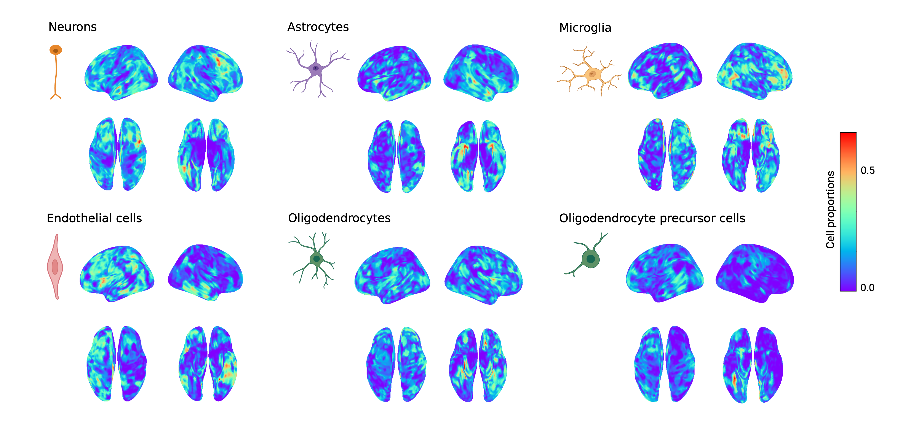

# Whole-brain 3D maps of cellular abundance for six canonical cell-types in humans

<p align="center">

</p>

High-resolution imputed maps of spatial cell-type distributions can be used to study variations in cell-type density in relation to macroscale phenotypes. These maps can be utilized in studies focused on both the structure and function of the brain in health and disease, specifically within the context of neurological conditions including neurodegenerative, neurodevelopmental, and psychiatric disorders.


(c) Neuroinformatics for Personalized Medicine Lab (Neuro-PM): https://www.neuropm-lab.com/

Authors: Veronika Pak, Quadri Adewale, Professor Yasser Iturria Medina

DOI: 10.1101/2023.06.08.544227

Contact information: veronika.pak@mail.mcgill.ca

## Description
- six brain cell-types: ast - astrocytes, end - endothelial cells, mic - microglia, neu - neurons, oli - oligodendrocytes, opc - oligodendrocyte precursor cells
- NIfTI format
- 1.5 mm resolution
- ~460,600 gray matter voxels across the whole brain
- registered to the Montreal Neurological Institute (MNI) brain space
- normalized and scaled relative to gray matter volume distribution
- reconstructed from post-mortem bulk gene expression data from the Allen Human Brain Atlas
- for methods, see [publication](https://doi.org/10.1101/2023.06.08.544227)

## Citation
``` Veronika Pak, Quadri Adewale, Danilo Bzdok, Mahsa Dadar, Yashar Zeighami, Yasser Iturria-Medina. Distinctive Whole-brain Cell-Types Patterns Strongly Predict Tissue Damage in Eleven Neurodegenerative Disorders. eLife. https://doi.org/10.1101/2023.06.08.544227 ```
